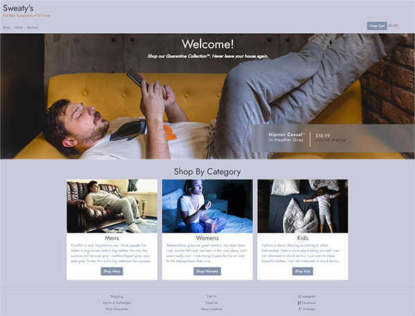
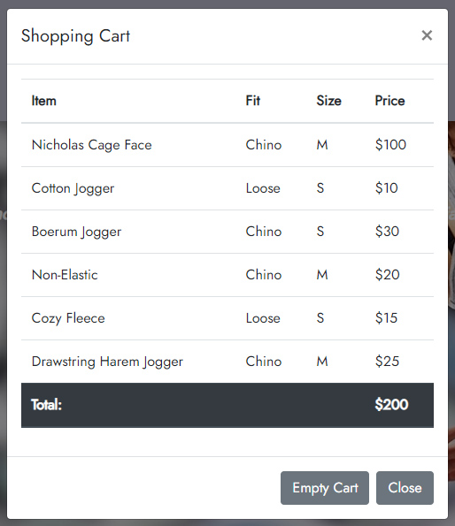
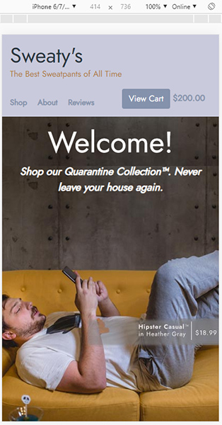

# Sweaty's Sweatpants Shop

## Description:
The objective of the group project was to create a fictitious e-commerce site for a company that sells sweatpants. This was built as a group project assignment during my enrollment at [Nashville Software School](http://nashvillesoftwareschool.com/) while we were learning to use HTML, CSS, JavaScript, and Bootstrap. 

## Features:
* Responsive design
* Categories on Homepage link to shop page and filter contents.
* Shopping Cart data stored in localStorage. Data saved after page reloads, and across browser sessions.
* Navbar updates cart total when item added, persists on navigation to new page and across broswer sessions. 

## Screenshots
 ##### Homepage

##### Shopping Cart

##### Responsive Design

## Developers
* Matt Logan : https://github.com/MLogan1998
* Pete Stewart : https://github.com/petestewart72
* William Campbell : https://github.com/wcampbell91
* Nate Owens : https://github.com/nathanieltylerowens

## How To Run:
> Project is deployed at [https://sweatys-b094a.web.app/](https://sweatys-b094a.web.app/)

## Technologies Used
  

